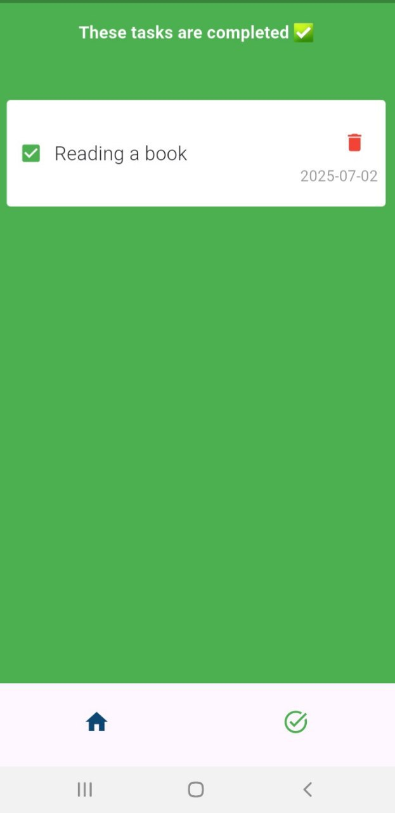

# ✅ To-Do App

A simple and efficient Flutter to-do list app built using `flutter_bloc`, `Hive` for local storage, and a clean architecture approach. This app helps users manage tasks with a smooth and responsive interface, and all data is stored offline on the device.

---

## 🚀 Features

- ✍️ Add, edit, and delete to-do tasks
- 📁 All tasks saved locally using Hive
- ⚡️ Fast performance with local database (no internet required)
- 🔄 State management using the BLoC pattern
- 📱 Responsive and clean Flutter UI

---

## 🧱 State Management

This app uses the `flutter_bloc` package to implement the BLoC (Business Logic Component) pattern.  
BLoC handles all UI state transitions like:

- Adding new tasks
- Updating task completion status
- Deleting tasks
- Persisting changes to Hive

---

## 🗃 Local Database

This app uses the `hive` and `hive_flutter` packages to store all tasks on the device.  
Each to-do item is modeled as a Hive object and persisted locally.

The following packages help with code generation for Hive:
- `build_runner`
- `hive_generator`

---

## 📸 Screenshots

  

  

 
## 📦 Packages Used

| Package              | Version    | Description                                                                 |
|----------------------|------------|-----------------------------------------------------------------------------|
| `flutter_bloc`       | ^9.1.1     | State management using the BLoC pattern                                     |
| `hive`               | ^2.2.3     | Lightweight, fast NoSQL database for local storage                          |
| `hive_flutter`       | ^1.1.0     | Flutter-specific extensions for Hive (e.g., `Hive.initFlutter()`)           |
| `path_provider`      | ^2.1.5     | Provides paths to store Hive data locally on the device                     |

### 🧰 Dev Dependencies

| Package              | Version    | Description                                                                 |
|----------------------|------------|-----------------------------------------------------------------------------|
| `build_runner`       | ^2.4.15    | Code generation tool required for Hive adapters                             |
| `hive_generator`     | ^2.0.1     | Generates Hive TypeAdapters from your models                                |

⚠️ License
This project is not licensed yet.
If you want to use or modify this app for any purpose, please contact me first
